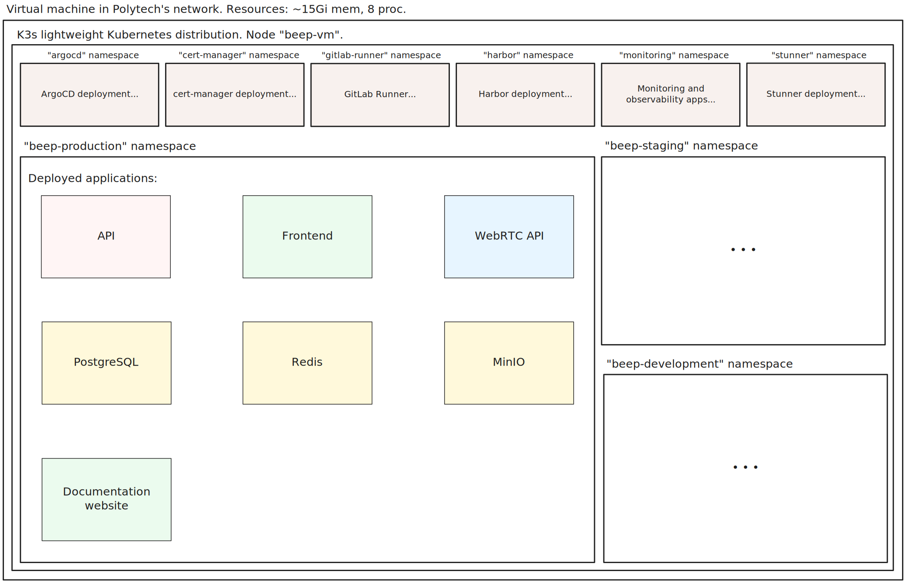

= AsciiDoc Article Title
Théo Tchilinguirian <theo.tchilinguirian@etu.umontpellier.fr>
14.02.2025
//:doctype: book ? Article?
:toc:
//:sectnums:
//:partnums: These two are for auto-generated chapter/section numbers! Can be configured I believe.

**My guide to this TAD**

====
Chapters (==)
"In the following sections, I/we will..."
"The following sections concern..."

Sections (===)
"In this section, I/we will..."
"The following section concerns..."
====

====
**Pronouns**

TODO: choose the right pronoun to use between  "I" and "we" for the whole document. +
https://www.writing-skills.com/knowledge-hub/business-report-writing/can-you-use-i-we-in-report +
Maybe mix the two. "I" for when I suggest something, and "we" for when we dive into why I chose this (benchmarks, comparisions, I include the reader.s). +
A suggestion is personal, but a choice is shared. As well as the reasons that led to this choice. +

=> Use "I" for personal suggestions, "we" for choices and explanations/reasons; where the reader should be included. +
=> TODO: make sure this rule is applied and respected throughout the document.
====

====
**Chaque choix doit être argumenté et justifié objectivement:**

- POCs,
- Nombres réels (benchmarks, comparaisons, estimations des différentes limites de perf/réseau/charge/ressources... etc.)
- Comparaisons avec d'autres solutions, avantages et inconvénients objectifs (perfs, DX, future proofness de la solution (modularité, scalabilité, extensibilité...), etc.)
- Sources citées à chaque fois que nécessaire
- ... (trouver plus de règles pour mieux définir ce framework à appliquer sur le TAD. Voir sur internet. De mêmes pour les autres groupes de règles à appliquer sur le TAD.)

Appliquer ces règles autant que possibler. +
Vérifier que ces règles sont appliquées sur tout le document.
====

====
**Under every question:**

- Use What Why How to distribute the text ideas & knowledge, if and when it makes sense. You may need to break it down further.
- Visuals (schema, graphs) (at least one)
- Make a PoC where asked, and when relevant. It must provide a real example of the implementation, and useful results such as performance metrics, usability, etc.
- Use real data / estimations to support choices and motives. This is real design, using real cost metrics of time, capacity, resources etc.
- Cite your sources at the end of the question

====

====
**Instructions:**

We are looking to migrate BEEP to a microservices architecture.
The specifications are the same as described during all previous iterations of beep.

You will need to answer 10 questions:

- Via the redaction of the TAD (components architecture, sequences diagram, deployment architecture, etc.)
- Via the production of POCs (when mentioned)
- For your schema, use draw.io
- Redact your report using asciidoc

You are forbidden to propose or consider the following technologies: 

- Messages queue
- CQRS
- Event Sourcing
====

====
**POCs:**

poccer en Rust. Peut être en Go pour certains +
=> Prendre plus la main dessus (pour le stage) + Avantages et inconvénients détaillés au niveau des examinations des POCs.
====

//TODO: replace diagrams with PlantUML?
//https://docs.asciidoctor.org/diagram-extension/latest/diagram_types/plantuml/

== Glossary

In alphabetical order.

"The purpose of a glossary is to provide definitions for words or phrases that may be unfamiliar to the reader, or that have a specialized or technical meaning within the context of the document."

//TODO: fill glossary with relevant terms and definitions.

== The What and Why of Beep and the microservices architecture

//TODO: complete this section. Section preface/number zero.

In the following sections, I will provide a brief overview of Beep, why it exists, its current architecture, what a microservices architecture is, and why Beep should consider migrating to a microservices architecture.

=== Current state of Beep

Beep is a platform for sharing and communicating with friends communities. With Beep, you have instant messaging, file sharing, real-time voice and video. It's entirely free, and the code is soon to be open sourced.

We first started Beep in January 2024 as a school project. It currently runs on our school's infrastructure. What's neat about Beep is that there are no paid features, lots of features get added from time to time, you'll soon be able to read the code and contribute; and most importantly, if we had a community to listen to, we probably would!! Maybe. Probably.

The below image is a rudimentary overview of Beep's current architecture, as of March 2025.

.Rudimentary overview of Beep's current architecture, as of March 2025. Made with Excalidraw.
[Drawing of Beep's architecture showing the VM, K3s cluster, namespaces and deployments, nested inside each others, with arbitrary sizes and colours.]

The purpose of this schema is for you to have a quick understanding of the curent the components and their interactions. Colours, shapes and sizes have no particular meaning.

Currently, Beep is deployed as a set of monolithic services and auxiliary tools (such as observability tools, registries, etc.) replicated on a single-node K3s cluster. The control plane is also part of this node. The K3s Kubernetes distribution is configured (by default, as is here) to use an embedded SQLite as its data store; and Flannel as a layer 3 network fabric/CNI plugin.

The frontend and backend are monolithic, and the database is centralized. The monitoring and observability services are also centralized. The whole system is deployed on Kubernetes, and the infrastructure is hosted on a VM or a proxmox cluster. Namespaces are used to separate the services into business capabilities or functionalities neighborhoods.

An important part to bear in mind throughout this document is Beep's current database s

=== Microservices architecture explained

Following the goal of this document, in this section, we will focus on a short explanation of what a microservices architecture is. In later section, we will go through why Beep should consider migrating to a microservices architecture. The following chapters of this document will focus on what needs to be done to migrate the architecture, and how to do it.

The microservices architecture is an architectural style or pattern, which follows four main principles:

- Services are (typically) organized around business capabilities,
- Each service is owned by its own team,
- Each service is independently deployable,
- Services are loosely coupled.

These principles make up the basis of the microservices architecture. There's a lot to it, it's got plenty of advantages as well as disadvantages. In short, it's not a miracle solution.

==== Benefits

- Simple services: "microservices" are only "micro" in terms of their single business capability provided, not in size. As such, they are simpler than the whole, easier to understand, maintain and upgrade.
- Team autonomy: services are independently developed, tested, managed and deployed (,the whole lifecycle is managed independently). They run independently from each other. As such, teams can work independently of each other, cutting down on the time it takes to manage intertwined teams.
- Faster CI/CD processes: services independence also cuts on the time it takes to build, test and deploy each service, thanks to their relative size compared to the whole.
- Support different paradigms per service: service independence allows each team to chose different paradigms freely - such as using a different technology stack, which is managed and maintained by this team.
//TODO: review/redo benefits. Also maybe talk more about scalability, fine grained control

==== Drawbacks

- Complexity: a distributed architecture is more complex than a monolithic one on every level: networks, observability, latency, authorization, authentication, service coupling... - all needs to be rethought and managed in a distributed environment, and new problems arise. The architecture itself is difficult to properly understand and design.
- Some distributed operations might involve tight runtime coupling between services, which reduces their availability.//
- Risk of tight design-time coupling between services, which requires time consuming lockstep changes//
//TODO: refactor drawbacks
//TODO: add numbers? Objective stuff?

A microservices architecture doesn't suit all needs, and it takes a lot of effort to properly design a suiting microservices architecture. Initial design or redesign decisions may lead to unforeseen consequencies in the future, that may be difficult to correct afterwards.

=== Why Beep should consider migrating to a microservices architecture

In this section, I will explain why the Beep team should consider migrating to a microservices architecture.

As students, migrating Beep to a microservices architecture is a very rewarding exercise. But more than that, it's a necessary step if we expect Beep to be able to accomodate hundreds, if not thousands of users and still be in control of our applications and infrastructure.

Considering our currently small team, moderate resources and recent concerns, what I believe Beep needs most from the microservices architecture is mostly better fine-grained control over scalability, security and observability between and around our deployed workloads, but also to enable us to add features more seamlessly, without potentially impacting the whole system's integrity.
//TODO: add numbers and estimations on limits, physical limits, number of users, etc. Or maybe in the next section?

== I. Separating Beep into functional neighborhoods and microservices

//TODO: find the right vocabulary to refer to functional neighborhoods/business capabilities/units/etc. in the right places. Be clear and concise.

The following sections concern my proposal to separate the Beep application into functional neighborhoods and microservices.

Before we can separate Beep into services, we need to have an idea of how Beep's functionalities can be grouped into autonomous business units/ functionality neighboroods. +

//TODO: review if this is summary still correct (and needed?).
1. For that purpose, we will first identify the user stories that define how people interface with Beep's functionalities.
2. Then, building on that, we will classify the identified functionalities of Beep into logical groups, or business capabilities/functionalities neighborhoods.
3. Lastly, from these logical groupings of functionalities, we will propose a separation of Beep into functional neighborhoods and microservices.
// Saying "functional neighborhood", "user story", "business capability" so soon, before explaining what they are, may be a bad idea, and confuse the reader.

=== 1. Identifying user stories

In this section, I will identify the user stories that make up Beep's functionalities.

[TIP]
A user story is an informal, natural language description of feature from the perspective of the end user. It typically follows the format: "As a [type of user], I want [some goal] so that [some reason]".

==== User stories currently in Beep

In the following table, the following subjects are identified:

- Guest: a user who does not have an account on Beep, or a logged-out user.
- User: a user who has an account on Beep, and is logged-in.
- Member: a user who is part of, and connected on a server on Beep.
- Authorized member: a user who is a member of a server on Beep, and has special permissions.
- Beep admin: a user who is an administrator of Beep, part of the Beep team.

[cols="1,1,2"]
|===
|As a |I want to |So that I can

|Guest
|Create an account
|Use the features of Beep.

|User
|Create a server 
|Grow a community around it.

|User
|Join existing servers
|Become a member of public and private communities.

|User
|Explore public servers
|Become a member of the public communities of my choosing.

|User
|Join private servers on invitation
|Become a member of private communities I'm allowed to join.

|User
|Have quick access to the servers I'm a part of
|Easily switch between communities and user groups to interact with.

|Member
|Get information about my account
|Review my account information.

|Member
|Update my account information
|Modify my personal information, recovery mechanisms, my authentication mechanisms, language and other information relative to my account.

|Member
|Get more information about other users in a server I'm a member of
|Better interact with them, and send them friend requests to chat in private messages.

|Authorized member
|Configure a server I'm a member of
|Manage the server settings, appearance and user roles.

|Authorized member
|Generate a time-limited invitation link to a server I'm a member of
|Invite other users to join the server.

|Authorized member
|Create and manage roles in a server I'm a member of
|Allow or restrain other users to do specific actions or see specific channels

|Authorized member
|Create and manage channels and categories in a server I'm a member of
|Group discussions by topics or themes, manage the visibility of these discussions, and pin messages.

|User
|Send messages, including markdown text and emojis, files and images, links with interactive previews
|Interact with other users in channels inside servers or in private messages.

|User
|Mention other users in messages
|Notify other users.

|User
|Share my voice, video and screen with other users
|Communicate with other users with real-time voice, video and screen sharing.

|===

==== Important user stories that are not yet part of Beep

[cols="1,1,2"]
|===
|As a |I want to |So that I can

|User
|Delete my account
|Remove my account information from the apps and servers.

|User
|Get information about my account
|Review my account information.

|User
|Update my account information
|Modify my personal information, recovery mechanisms, my authentication mechanisms, language and other information relative to my account.

|Member
|Search for messages or files in a channel in a server I'm a member of
|Find back specific conversations or files.

|Beep admin
|Have full control over public servers
|Ensure Beep's terms of service are respected across publicly accessible servers.

|===

==== Use case diagram of Beep's current user stories

These user stories can be formally represented using a UML use case diagram. Below is the use case diagram describing Beep's current user stories, with the end user's different roles as actors, and the user stories as use cases.

.Use case diagram of Beep's current user stories. Made with draw.io
image::images/fig2.use-case-current/beep-uml-use-case-diagram-automatic-trans.svg[Use case diagram of Beep's current user stories.]

The purpose of this schema is to capture the requirements of Beep considering its users. This will help us outline business capabilities and user stories into functional neighborhoods, and thus redefine Beep into microservices.
//TODO: stop the blabla between business capabilities and user stories. Time to be clear and concise, bro. Yeah.

A business capability is the expression or articulation of the capacity, materials, and expertise an organization needs to perform core functions.

==== Separating Beep's user stories into functional neighborhoods

In this section, we will classify the user stories we identified into functional neighborhoods.

A functional neighborhood is a group of functionalities that are related to a specific business capability (in Beep).
// Is it a bit late to define this term? Or is it good here? Follow where each term is defined. Also add them to the glossary? If we assume the reader doesn't know these terms? See how it's done in academics. Who would read this?
// This definition is worth nothing if "business capability" isn't defined earlier.

From our previous analysis, the following services can be identified:

[cols="1,1,2"]
|===
|Functional neighborhood |Corresponding user stories |Description

|Authentication / User

|Authorization

|

|===

We can be tempted to separate Beep into microservices following the current SQL database's schema and relations, that we saw in the initial chapter. But this would be a mistake, since as we defined in the initial chapter, microservices should be organized around business capabilities; and the current database schema is not a faithful representation of Beep's business capabilities, as opposed to the user stories, business capabilities and functionalities their represent, that we identified in the earlier sections. +
If we had defined Beep's microservices architecture from its initial database schema, we would end up with a distributed monolithic architecture, with tightly coupled services, a lot of inter-service communication, and thus scalability, and other benefits of a microservices architecture would be impacted.

==== Component diagram proposal for separating Beep into microservices

These functional neighborhoods/business capabilities/... can be formally represented using a UML component diagram. Below is the components diagram describing my proposal for Beep's separation into microservices.

The resulting UML component diagram

(diagram)

Authentication and authorization services do not appear in this diagram will be defined in later chapters.

**POUR LE DIAGRAMME DES MICROSERVICES!!!!!!!!!:** https://stackoverflow.com/a/60084889
Et avant, pour le diagramme des usages, celui avec les bonhommes
Et un activity diagram pour chaque user story/=le service rendu par chaque microservice (=authentication, etc.). Ou un sequence diagram? J'ai encore du mal à voir la différence entre les deux.

Decompose services by business capabilities : reflect organization behavior. -> component diagram.
En partant du domaine (communications temps réel), on va créer les différents services. Attention aux services qui communiquent beaucoup entre eux : **combiner les services**.

Pattern de DDDevelopment : Bounded Contexts. = Separate by subdomains. I thnik.
https://martinfowler.com/bliki/BoundedContext.html

Obstacles à la décomposition : network latency, data inconsistency/interfaces, god classes (fait tout, dure à décomposer, big) and reduced availability. Énormément de contextes sont impactés.

Thématiques 12 factors !!!
https://12factor.net/
"The philosophy of Twelve-Factor turned out to be surprisingly timeless. More than a decade later, people still find its insights valuable, and it's often cited as a solid set of best practices for application development. But while the concepts remain relevant, many of the details have started to show their age."
Domain-Driven Development. Application est construite sous forme d'abstractions au dessus de notre modèle.

https://leofvo.me/articles/microservices-for-the-win

Architecture bien définie avec le DDD, bounded contexts. Architecture (enables org & proc), organization (enables proc) et process de développement => rapid, frequent & reliable delivery of software.

**1 service = 1 responsabilité. Un service rendu. N'est responsable que d'une chose à faire.**

Guidelines :
Dur à faire mais génial : signifie une bonne séparation des services : c'est le **Common Closure Pattern**.
En gros, une règle business n'affecte que 1 microservice, pas deux ou plus (si cette règle évolue il faudrait modifier plusieurs services...)
Disons que j'ai à modifier le mode de livraison : que ça ne soit fait que dans un seul service !!!

**Open Closed Princple** : on veut pouvoir intégrer facilement d'autres contrats d'API sans avoir à changer le coeur de fonctionnalités !!! -> Réelle abstraction. Logique non liée aux contrats d'APIs. => Des interfaces/contrats d'API génériques (comme un filesystem : create, read, update, delete, open d'un objet générique (fichier) ET NON PAS un type de fichier spécifique. C'est toujours que des fichiers ultra génériques avec leurs mêmes attributs communs : nom, taille, permissions, etc.)

Event-driven architecture, aggregates.
Si tu veux récup touuut l'historique d'un truc pour calculer le produit final (ensemble de transactions pour la balance de mon compte en banque) -> un aggrégat, recalculé de temps en temps (pas à chaque transaction car serait lourd sur le systèmes, triggers bdd) stocke le total pour éviter d'avoir à le recalculer tlt.

Data access / database transactions in microservices. Saga pattern ? Another service that knows which services to go to to answer this query to give it back to the asking service?

repository : expose un contrat pour la bdd. Appelé par les autres composants du service. Reprend l'open closed principle. Classe qui permet d'accéder à tes données.

http://butunclebob.com/ArticleS.UncleBob.PrinciplesOfOod

Functional requirements: US, functions.
Quality of a service: scalable, reliable, secure, maintainable, testable, etc.
=> Implementable functionalities are dependent on the quality of the architecture design. Future-proof design, stays easy to update with features, good abstractions (see how good filesystems are :3)

Liskov principle, ouvert en extension fermé en modification (en gros les bonnes abstractions type filesystem)

Je veux utiliser une autre bdd. Ou en utiliser plusieurs.
Hexagonal architecture. Des adaptateurs (que l'on branche sur un port) qui permettent de réaliser des opérations qui soient indépendantes de ce qu'il y a derrière (mongodb, postgres, filesystem...!! C'est dans l'adaptateur qu'on définit ça)

Communication. Message-driven architecture.
Comm synchrone : http de l'un à l'autre, si l'autre tombe, la comm passe pas.
Comm asynchrone : Envoie de mail. On l'envoie. il sera stocké et reçu à un moment dès que possible quand le service de réception/envoi sera good.

**API composition pattern for microservices :** un service a la connaissance des autres services, connaît les contrats API qui permettent de les faire parler entre eux : fait de la composition.
Tu as Cours et Etudiant : le machin map les deux. Et en plus peut enrichir la donnée ! Avec dans quel service elle est passée, etc. I thnik.

=== 2. Proposal of separations into functional neighborhoods

via business capabilities of services to separate into.

In this subsection, I will give my proposal to separate the Beep application into functional neighborhoods and microservices.

=== 3. How Beep can migrate to a microservices architecture: Breaking down the Monoliths

Earlier, we saw an overview of Beep's current architecture, of the microservices architecture, and why Beep should consider migrating to a microservices architecture. +
In the last section, we went over my proposal to separate Beep into functional neighborhoods and microservices. +
In this section, I will give my answers to how the Beep team can break down the application into microservices.

Redefine all functionalities in the form:

- “As [guest user / server admin / ...], I want to [create a channel / ...] so that [the user can self-assess his channel / ...]”
- Organize these proposals into coherent functional neighborhoods
- Propose an architecture diagram for the breakdown of your application into (functional) microservices.

Help resources: 

- https://microservices.io/articles/glossary#dora-metrics
- https://martinfowler.com/bliki/BoundedContext.html
- https://martinfowler.com/articles/break-monolith-into-microservices.html
- https://leofvo.me/articles/microservices-for-the-win

List / table to divide Beep into functional neighborhoods, then into services.
See online: "how to break up a monolith". Citer les sources à chaque question.

Schémas draw.io

> Business capability is the expression or articulation of the capacity, materials, and expertise an organization needs to perform core functions.

https://martinfowler.com/articles/break-monolith-into-microservices.html
commencer avec 1 service simple, puis on conçoit/dessine des services en fonction des "capacités verticales", qui sont importantes au "business", et sujettes à des changements fréquents.
> "These services should be large at first and preferably not dependent upon the remaining monolith. We should ensure that each step of migration represents an atomic improvement to the overall architecture."

What?

> "Before embarking, it is critical that everyone has a common understanding of a microservices ecosystem."

> "Microservices ecosystem is a platform of services each encapsulating a business capability. A business capability represents what a business does in a particular domain to fulfill its objectives and responsibilities."

> "The microservices ecosystem enforces an organizational structure of autonomous long standing teams, each responsible for one or multiple services. Contrary to general perception and ‘micro’ in microservices, the size of each service matters least and may vary depending on the operational maturity of the organization." (microservices = label, not a description)

Why?

> "The ones who embark on this journey have aspirations such as increasing the scale of operation, accelerating the pace of change and escaping the high cost of change. They want to grow their number of teams while enabling them to deliver value in parallel and independently of each other. They want to rapidly experiment with their business's core capabilities and deliver value faster. They also want to escape the high cost associated with making changes to their existing monolithic systems."

> "Microservices have independent lifecycle. Developers can build, test and release each microservice independently."

How?

> "Deciding what capability to decouple when and how to migrate incrementally are some of the architectural challenges of decomposing a monolith to an ecosystem of microservices."

https://microservices.io/refactoring/
https://microservices.io/patterns/
https://microservices.io/patterns/microservices.html
https://microservices.io/patterns/decomposition/decompose-by-business-capability.html
https://microservices.io/patterns/data/saga.html
https://microservices.io/post/refactoring/2019/10/09/refactoring-to-microservices.html
https://microservices.io/post/architecture/2024/08/27/architecting-microservices-for-fast-flow.html

Gérer les migrations de bdd, les insertions de bdd dans une architecture microservices ? -> Trino !! (? Piste à explorer).
https://trino.io/blog/2020/06/16/presto-summit-zuora.html PS: Trino s'appelait PrestoSQL avant.
https://moduscreate.com/blog/microservices-databases-migrations/
Paraît que marche encore mieux avec les trucs datalake, Hive, Iceberg...

use kafka for inter-microservices communication?
https://www.youtube.com/watch?v=Vz2DHAHn7OU

Was told this is a good tutorial to understand async await (in rust at least, but maybe in general!): https://tokio.rs/tokio/tutorial
https://stackoverflow.blog/2020/03/02/best-practices-for-rest-api-design/
https://stackoverflow.com/questions/60457740/rest-endpoint-for-complex-actions
https://stackoverflow.com/a/60463179

when is microservice not a good pattern
https://dzone.com/articles/10-microservices-anti-patterns-you-need-to-avoid

== II. Managing the authentication system with OIDC

Lier les méthodes d'authentification aux comptes

https://developers.google.com/identity/protocols/oauth2

Oauth2: https://www.youtube.com/watch?v=ZV5yTm4pT8g
OIDC (surcouche ?): https://www.youtube.com/watch?v=t18YB3xDfXI

à GCP, pour la comm entre CHAQUE service, y'a un système d'AUTHENT puis d'authorization !!! Pas juste authorization (0 trust approach). Est-ce que ça suffit d'avoir du chiffrement entre les services, ou faut-il un système d'auth complet ?

Faut des trucs en plus pour les microservices :
Circuit breaking pattern. Important pour les microservices pour pas que ça call en continue avec les retry réseau. Retry exponentiel (1s, 10s, 1mn... et que ça bloque tout le service) -> on arrête d'appeler le service (on ouvre le circuit) et pas mécanisme de fallback (réponse préfaite en cas de pb, genre "ah dsl jpp afficher ça en fait" alors que ça chargeait) -> En gros gestion d'erreur réseau en fait. Pour éviter surcharge réseau + jamais de réponse.
Aussi circuit breaking, fault tolerance, latency... Problématiques de microservices entre eux.
-> Quota (peut faire 1M d'appels à service X sur un mois, etc) + Rate limiting (même chose mais sur une période très courte, genre secondes ou 1mn).

Et logging, metrics (métriques techniques, CPU, etc. Ou plus fonctionnelles rédigées par le développeur genre nb de requêtes, etc.), distributed tracings (suivre l'appel de son entrée et toutes ses transitations de svc en svc. Permet d'identifier dans quel svc y'a des pbs quand y'a un pb sur la requete, genre latence ou erreurs) et topology.

Security, observability, network resilience (genre trucs de circuit breaking etc), policies. En sidecar containers (envoy??) en PLUS du service logique !! dans le pod. Donc un container app et un container proxy qui a les 4 trucs secu, obs, netw resi et poli. Qui intercepte en premier tous les calls puis retransmet.

Inscrire les services et leurs endpoints dans une bibliothèque de services, un "service discovery". Pour gérer leur scalabilité et des trucs.

Dans un service mesh : Il y a un control plane : api/interface pour donner des instructions pour configurer le control plane, ses proxy qui vont appliquer les configs (d'auth, de traffic management, de sécu réseau type ntls?mtls? c'était mTLS etc. Certaines traitées en inbound ou outbound du proxy), etc;
Pour les microservices, le service mesh permet de gérer facilement le traffic entrant, sortant et intérieur aux services (traffic splitting, canary, blue-green, mirroring...), sécuriser l'accès et comms (mTLS etc.), et visibilité complète sur etc.

mTLS avec Istio ou HCP Consul

Tout ça est implémenté dans Istio !!!!

https://istio.io/latest/docs/tasks/
Exemples de comment mettre en oeuvre ces fonctionnalités !!!!!!!!!!

https://www.cloudflare.com/learning/access-management/what-is-mutual-tls/
https://www.youtube.com/watch?v=uWmZZyaHFEY

OAUTH
OIDC
SSO
SAML

https://samarthasthan.com/posts/building-a-scalable-e-commerce-empire-a-micro-services-system-design-approach/
https://www.geeksforgeeks.org/how-discord-scaled-to-15-million-users-on-one-server/

== III. Enabling communication between services

The following sections concern my proposal of design and implementations for the communication between the microservices of Beep.

gRPC, etc, other binary protocols formats stuffs...

GraphQL!!! Format binaire underlying est interchangeable !!
Par contre faut build soit-même les APIs? à voir. Pas grave en vrai. Mais faut les modifier soi-même ??

Si je comprends p'tet, avec graphql tu renvoies masse de données et tu filtres ce groc bloc côté client. Donc faut modif ton code client généré. Et faire bien attention à l'aspect sécurité... ? À tester si c'est bien ça la différence. Noter les différences. Pour plus tard les comparer.
Ou graphql pour server-client final et grpc pour service - service ?
When to use gRPC or graphql? Do they even compare? If so, how?
GraphQL for microservices?
"[GraphQL] permet notamment aux consommateurs de l’API de demander seulement les champs nécessaires à l’inverse d’une API REST qui expose un schéma prédéfini."
https://affluences.com/blog/optimiser-architecture-micro-services/
Ah oui en effet niveau sécurité ça a l'air dur à gérer, si ton service toi exposer tout à tous les autres services et que c'est à eux de choisir... Ou à l'inverse... ??
J'ai juste l'impression que ça ne suit PAS DU TOUT le principe de "smart data struct for simple code vs dumb data structure for complex code". Donc pour l'instant c'est un non. Le code serait dur à maintenir/scaler, et dur à sécuriser, il me semble. Et c'est aussi deux retours que j'ai lu. Un peu biaisé, mais aussi en partie logique. !! => Answer to "Why [gRPC and] not GraphQL?"

In rust, with grpc? Contribute to Tonic's doc cuz it's shit, on build.rs setup?
grpc cuz kube, google etc? Real motives. Why other are not better choices. USE REAL NUMBERS like estimations to say why they're not better!!! See kafka cours .md obsidian

Quelle architecutre ? Saga pattern ? Kube avec apiserver et etcd centralisé ? Juste etcd centralisé ? Ou tout state et api distribué ? Ou juste API centralisé et state distribué ??
Comment dissocier le storage ?
Rajouter des questions sur le TAD ? Lel

Poc : 2 services Rust. Chacun une BDD : postgres et l'autre mysql ou autre. Pour montrer que peut séparer ainsi les systèmes (mongodb, sqlite auraient pû être choisis aussi !) scylladb, etc.
Serveur / user ? Ou un truc du genre. Ou channel / message.
et un docker compose. deux dockerfile.

Et même poc mais avec autre chose que grpc.

3 dossiers, 1 .git. 1 dossier common / interfaces / whatever avec les .protos ou autre, 1 pr le premier service (cargo new) et un autre pr le second service (cargo new). Ou le faire en Go. Dépend de ce que veut poccer.

Pourquoi Rust? Car <avantages du Rust> + désavantages du rust : plus gros binaires. Mais pas important dans le use case de beep, car (etc C +petit mais on fait pas de l'IOT et etc etc). Voir même bénéfique car bien plus petit que environnement typescript anyways car (etc. nodemodules frameworks node deno pnpm npm etc)
Y-a-t-l un site qui recense les avantages et désavantages comparés du Rust? ptet! Ou un blog post idk. Le citer, dater sa lecture, et sortir la citation datée !

Faire un joli schéma du poc.

Schémas : UML ? Séquence, composants, useCase (avec le bonhomme) + des plus classiques, architecturaux à la mano non-standards compréhensibles sans app des règles ? Ou c'est kaka ? :X Je crois que c kk..

gRPC/Protobuf / Avro / Apache thrift (RPC), ultra modulaire. Par contre prise en main pas facile... Configs, etc. Mais fine-tunable.
Avro plus utilisé avec Kafka. Décodable du binaire au json! Tu as deux fichiers envoyés : metadonnées (défini le type, le champ que ça remplit etc). Et l'autre c'est de la donnée pure.
gRPC l'ordre des champs compte. gRPC envoie aussi le schéma supposément vu que gRPCurl peut curl comme ça. Il me semble.
gRPC plein de styles d'intéraction, stream bidirectionnel, etc.

Service registries pour qu'ils sachent qu'il y a eu une modif d'api ou quoi.

Sozu vs nginx, vs sozu? benchmarking!! (Dockerfiles) vs rpxy

=== Communication framework proposal

In this section, I will propose a communication framework for Beep's microservices.

In this proof of concept, I implement a communication framework between mock services. I used gRPC as the communication framework.

gRPC is... (what)

I chose gRPC because...
Some numbers... (why)
Compared to....

I implemented using Tonic... (how)

https://github.com/hyperium/tonic/blob/master/examples/helloworld-tutorial.md
https://github.com/theotchlx/inter-services-communication

on vm in proxmox.

== IV. Authorization system design and implementation

permissions ultra atomiques
regroupables
héritables
attachables à n'importe quelle ressource

équipe contient gens
équipe à des droits
les gens ont des droits aussi
les gens héritent les droits de l'équipe, mais sous forme d'un groupe de permissions qui porte le nom de cette équipe (comme ça paf on retire le gars de l'équipe -> ça màj les droits automatiquement - ou on ajoute un gars à l'équipe et paf il a ses droits màj)
les gens peuvent override les droits (comment gérer ça ?) -> un "yes" par défaut override ? Un "no" par défaut override ? Ou si la perm / ensemble de perms est placé avant, elles override ? (= rôles discord)
Ces groupes/ensembles de perms (=rôles beep) seraient donc attachés à une ressource, et héritables, et overridables.

what does google cloud handle authorization, permissions and policies? Not only via IAM, but in itself, in organizations/projects/...
IAM : __IDENTITY__!!!! and __access/authorization__!!! management!!!

principle of least privilege

Gérer les permissions par groupe de permissions

Les permissions sont le truc le plus atomique, qu'on verra toujours partout ! Il sera handle partout : service(s) pour le gérer ! (et pas ds chaque service sinon kk hihih)

Si jamais j'applique une modif des droits/perms alors que je peux pas, ou à l'inverse une modif ne s'applique pas (fait à la main en call api manuel, ou un service qui a foiré) du coup y'a un état transitoire à régler. Donc avoir un controller qui monitor ces états transitoires - ou plutôt monitor un etcd pour savoir si un truc est fait ou pas et s'il y a un truc à faire ? centralisé (comme dans kube), pas distribué. Mal ou bien ?
Quelle architecture ? Les comparer sur le TAD!!

> Note: The deny-all-ingress and allow-all-egress rules are also displayed, but you cannot check or uncheck them as they are implied. These two rules have a lower Priority (higher integers indicate lower priorities) so that the allow ICMP, custom, RDP and SSH rules are considered first.
"PRIORITY"

Service mesh

https://en.wikipedia.org/wiki/Attribute-based_access_control#API_and_microservices_security

Authorization / permissions services must be external from all other services, and they all need to use it. So... Why not integrate it directly inside of K8s ?
Kubernetes service meshes have proxies. Service mesh proxies that stand in front of services and handle the filtering, other stuff, etc. A lot. And OPA (Open Policy Agent) stands with the proxy, and handles the authorization policies.
https://www.openpolicyagent.org/docs/latest/
https://kubernetes.io/docs/reference/access-authn-authz/admission-controllers/
https://sysdig.com/blog/kubernetes-admission-controllers/

Is this how it can be done? Can OPA be configured to handle Beep's authorization service, or do we have to write it ourselves, or is there a protocol or standard to implement, or a config to set and then something (OPA maybe) handles the authorization for us?

FAIRE DU BENCHMARK GRPC (http/2 ?) VS HTTP REST ETC!!!!

https://istio.io/

Istio + OPA

Istio vs linkerd

Keycloak (and why not authentik)

OpenTelemetry
https://opentelemetry.io/docs/what-is-opentelemetry/
Jaeger, OTLP (otel line protocol), Prometheus -> OpenTelemetry collector
OTEL : très bien pour les traces. Attention Beta pour Rust. Metrics pas mal, logs bof. "Profiles" : juste annoncé.
"Zero code instrumentations" pour Go, Python, JS, Java ! Signifie + facile pr récup les logs (quasi pas de modifs à faire, se branche au runtime etc. Je peux aussi récupérer des données spécifiques à mon application)

https://prometheus.io/docs/introduction/overview/

Elasticsearch pr données à bcp de cardinalité
Sinon Loki
(entendu à conf cncf grafana sur OTEL)

https://opentelemetry.io/docs/specs/otlp/

https://cloud.google.com/iam/docs/roles-overview

https://medium.com/@sadoksmine8/understanding-identity-and-access-management-iam-in-gcp-a-detailed-exploration-57030ec37609

Permify : authorization for microservices. + patterns !!
https://play.permify.com
Ory / Krong microservices
OPA
Google Zanzibar
https://www.youtube.com/watch?v=5GG-VUvruzE

Chaos mesh

Oso
https://www.osohq.com/
https://github.com/osohq/oso
Mieux que OPA supposément. Niveau config et architecture du truc. Tester, poccer, prouver, comparer.

oso vs opa

https://github.com/Permify
Permify !!

https://getsops.io/
SOPS: encrypts data client-side(?verify), + sealedsecrets encrypts server-side.
https://getsops.io/docs/
It's CNCF-sandboxed. But I think it's a bit too much for now, and also this particular software doesn't seem extremely well defined/developed yet? See others.
But it's not really a current concern in Beep. I think. I dunno!
https://github.com/getsops/sops

== V. Tracing logs and queries

handling traces in the new distributed architecture
traces, logs, queries, metrics, observability, monitoring

snowflake to sort chronologically and etc

how does tracing work microservices

https://www.youtube.com/watch?v=XYvQHjWJJTE

== VI. Setting up a production ready system

cia triad
principle of privilege (including in service mesh)

Migrate infrastructure to a (or 3???) proxmox cluster. With a high-availability Kube on top. Separate etcd or not? Postgres as etcd or not?
Proxmox vs apache cloudstack vs openstack.

Apache Mesos: Program against your datacenter like it’s a single pool of resources. Kubernetes pour l'infra ou qq chose comme ça.

"Mesos propose deux modèles de fédération. Une première approche place toute l'infrastructure sous une couche de contrôle et crée une abstraction des ressources du datacenter, d'un cloud public, d'un déploiement de VM par exemple. Cette couche de contrôle forme une abstraction uniforme pour l'hébergement. Avec le deuxième modèle, la technologie rassemble des déploiements Mesos distincts de manière à ce qu'aucun ne soit relié à un autre, mais coopèrent tous de manière totalement distribuée et tolérante aux pannes."

https://www.baeldung.com/apache-mesos
https://mesos.apache.org/documentation/latest/
https://agenda.infn.it/event/29701/sessions/21750/attachments/88134/117909/Apache%20Mesos.pdf

CNI plugins: Flannel, cilium, calico, ... There are more good ones!
To read to understand stuff:
https://mvallim.github.io/kubernetes-under-the-hood/documentation/kube-flannel.html
https://kubernetes.io/docs/concepts/extend-kubernetes/compute-storage-net/network-plugins/
https://kubernetes.io/docs/concepts/cluster-administration/networking/
Flannel has basic features when compared to cilium/calico. Supposedly. I haven't tested it yet.

MinIO vs seaweedfs vs deuxfleurs's garage

Pour le load balancer à self hoster :
https://geek-cookbook.funkypenguin.co.nz/kubernetes/loadbalancer/
https://medium.com/@ferdinandklr/creating-a-production-ready-self-hosted-kubernetes-cluster-from-scratch-on-a-vps-ipv6-compatible-660aa5018feb
MetalLB(?)

== VII. Infrastructure security
design, implementation, automation and handling

cia triad
principle of privilege (including in service mesh)

== VIII. Search engine design and implementation

== IX. Managing platform security issues

== X. Integrating UI applications

microfrontends
